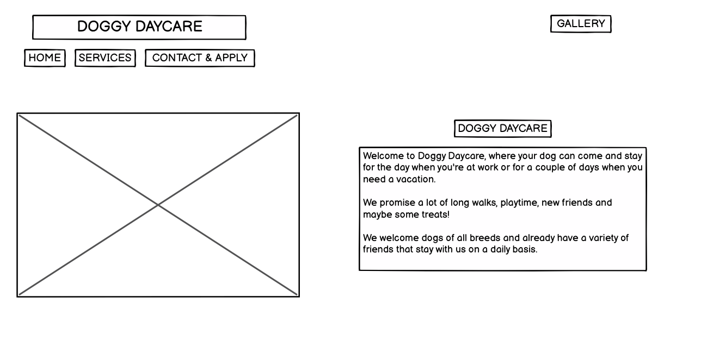
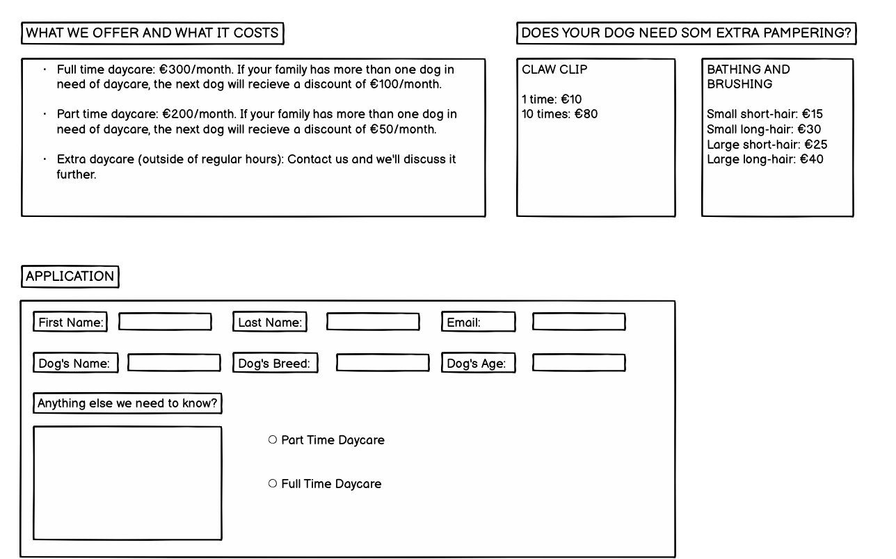
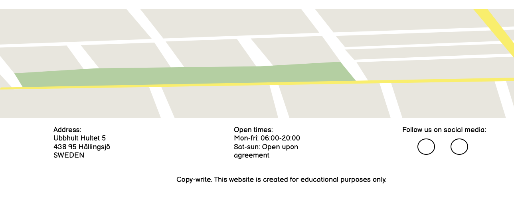

# Portfolio Project 1 - Doggy Daycare

The Doggy Daycare is a website for dog owners. Users that visit this webpage are looking for a place to leave their dogs when they are at work or on vacation. 

The users can on this website find information about the daycare, what services they offer, pricing, open times, contact information, the location, a signup form and they can also see photos from the daycare.

&nbsp;

## Wireframes 
---

Before starting the project I created a basic wireframe to have an idea of what my project would look like.

&nbsp;

## Features
---

### Navigation bar:
-   At the top of the page there is a logo with the name of the daycare: DOGGY DAYCARE, that links to the top of the page.
-	Three of the other navigation links are found directly beneath the logo: Gallery, Services and Application. Gallery links to a another page, Services and Application links to sections on the same page. 
-	The navigation bar makes it easier for the user to find the information of the different sections of the website. 
-	The navigation is in a font that is easy to read and in a color that contrasts with the background. 

&nbsp;

### About us Section
-   The header has a description of the daycare and what they offer to the owners and the dogs.
-   There's also information about open times in the header.
-   The section provides clear information about what the website is for. 

&nbsp;

### Open Times Section
- This part of the website is very straight forward: here the user can find the open times for the daycare, for when they can drop off and pick up their dog during the week.
- It also gives the user information about that the daycare can be open on the weekends as well, upon agreement. 

&nbsp;

### Services Section
-   The Services section provides information more in detail about what the daycare offers together with the prices. 
-	This section shows the user the information they need to have about the daycare to be able to decide about applying. 
-   In this section the owners of the dogs can also read about what extras they offer, things that can make it easier for the owner.
    Such as that the daycare can give the dog a bath for them. 

&nbsp;

### The Extras Section
- This section of the site informs the user about the extra services they can pay for while their dog is at the daycare, such as claw clipping and bathing etc.

&nbsp;

### Application Section
-	This section provides a form where the user can apply for a place at the daycare by providing the details required. 
-	The form collects information about the owners first name, last name and email address. It also collects information about the dog’s name, as well as their breed and age. 
-	In this section the owner also has to let the daycare know how much they want to leave their dog at the daycare.

&nbsp;

### Gallery Section
-	In the gallery section the user can view pictures taken of current dogs at the daycare in different environments. 
-	The navigation bar is locked and can also be viewed from the gallery section. 
-   From the gallery the user can also navigate back to the home page by clicking the "Doggy Daycare" logo, or by clicking "Services" or "Application" if that's the part of the page they would like to reach. 

&nbsp;

### Footer Section
-   In this section the user can find links to the social media of the daycare.
-   This section is also locked for it to be reachable from all pages. 

---
&nbsp;

## Testing (done before first submission, (second part of testing shown further down in README.))
-   I have tested that this page works on: Google Chrome and Safari.
-   I confirmed that this project is responsive, looks good and functions on all standard screens using the devtools device toolbar.
-   I confirmed that navigation, about us, signup and application are all readable and easy to understand.

### Bugs
-   My accessibility score was lower on the first test, I had missed connecting the labels to an input, inside the form. After that the score was better.

### Validator Testing 
-   HTML: 
    When I tested my code in the HTML validator I saw that I had missed adding a space beetween attributes. Solved by adding a space.
    Otherwise no errors were found.

-   CSS:
    No errors were found when passing through the official (JigSaw) Validator.

-   Accessibility: 
    I confirmed that the colors and fonts chosen are easy to read and accessible by running it through lighthouse in devtools. 

### Unfixed Bugs
-   Unfortunately the Performance part of the Lighthouse check was not good. So this would be something I would have to look further into.

&nbsp;

## Testing (second part before resubmission.)

Tested the navigation links from the homepage | They should take the user to either the gallery on another page or to the "services"/"application" part of the landing page | All links work as expected.

Tested the navigation links from the gallery | They should take the user back to the home page by clicking the "doggy daycare" logo or to the "services"/"application" part of the landing page | All links work as expected.

Tested the social media links in the footer | They should take the user to the home pages of Facebook, Youtube and Instagram | All links work as expected.

### Bugs

### Validator Testing
- HTML: 
    No errors where found when passing through [W3C Validator](https://validator.w3.org/nu/).

- CSS:
    No errors where found when passing through [Jigsaw Validator](https://jigsaw.w3.org/css-validator/).

### Unfixed Bugs
- No unfixed bugs have been found.

## Deployment

- The site was deployed to GitHub pages. These are the following steps:
    - In the GitHub repository, navitage to the Settings tab at the upper part of the page.
    - In the menu to the left, click the one called "Pages".
    - From the source drop-down menu, select "Deploy from a branch".
    - Select the branch called "main" and click save.
    - When all of these steps have been followed the site will reload and the deployed link will appear. Although, this might take a few minutes.
    
The live link can be found here: [Doggy Daycare](https://emeliehansson.github.io/milestone-p1-doggy-daycare/index.html).

## Credits
- For general information and tips I have used these websites: [W3 Schools](https://www.w3schools.com/) and [Developer Mozilla](https://developer.mozilla.org/en-US/).

### Content
- The code to make the social media links, the media queries, the masonry structure in the gallery and footer was found from the CI [Love Running](https://emeliehansson.github.io/love-running/) Project.
- The social media icons in the footer were taken from [Font Awesome](https://fontawesome.com/).
- The font style, Trispace, was found at [Google Fonts](https://fonts.google.com/).
- Images were reduced in size with use of [Tiny Png](https://tinypng.com/).

### Media
- The image on the header was found on [Pexels](https://www.pexels.com/sv-SE/).
- The images in the gallery are photos taken by myself, Ann Magnusson and a photographer called Jeanette Bergenstav.